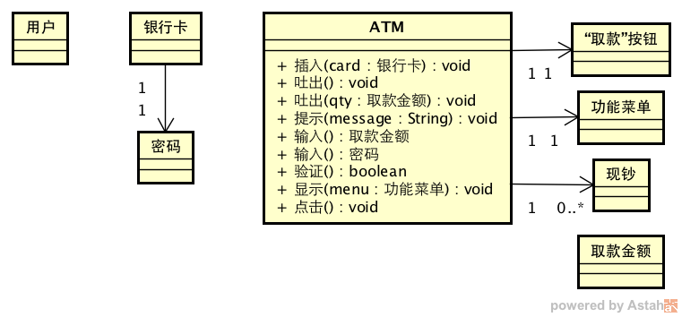
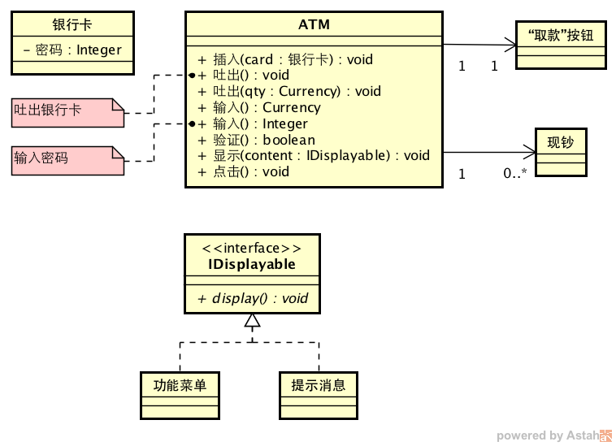

# 找工作需要做的准备

---

## 作者背景

- Carnegie Mellon University的Master of Software Engineering(软件工程)项目。
- 软工这个项目隶属于Institute of Software Research(ISR)。相近的专业还有MSIT-SE和MSIT-ESE(Embedded Software Engineering)。
- 软工这个项目跨度1年半，一共4个学期：秋季-春季-夏季-秋季。由于暑假需要上课和做project，故没有实习。
- 软工这个项目要求学生至少有2年以上的业界工作经验，美国的或外国的均可。

---

## 面向读者群

由于我毕业于软工这个项目，所以我的经验中部分只适用于软工项目的同学，不过里面一些技巧性质的东西应该还是具有普遍性的。

---

## 目录

- 找工作的大致时间表
- 找工作的原则
- 需要准备的材料
- 如何准备目标公司
- 关于着装要求
- 如何获取公司招聘信息
- 如何准备Linked-in
- 如何准备简历
- 如何刷题
- 如何准备OO design的面试
- 如何准备system design的面试
- 如何准备系统设计
- 如何准备behavioral questions
- 其它
    - 大致时间安排
    - cover letter

---

## 找工作的原则

我个人的原则是：

- **不海投**：尽量不要海投公司，因为海投有如下问题： 精力分散；需要准备的知识面扩大；有些behavioral question，比如why our company可能不容易给出很好的回答。不过如果外部找工作的整体环境不好的话，海投仍然不失为一种策略。
- **客制化(customization)**：如果是网投简历的话，我非常反对使用一份简历投所有的公司。我认为每个公司有自己的特点，每个职位也有自己的需求，应该让自己的简历能非常契合公司的需求，公司才更愿意考虑给你面试的机会。在现场的招聘会中，往往没有精力为每一家公司准备专门的简历，这个时候我认为准备相同的简历也是没问题的，毕竟有机会和recruiter面谈，可以把简历上没有充分反映出来的东西说出来。

---

## 需要准备的材料

一般准备好下面的材料就可以满足绝大多数公司的申请要求了：

- 目标公司(给目标公司分级别：一般想去；很想去；dream company)
- 商务正装或商务休闲装
- 简历(resume)
- Cover letter
- Linked-in
- GitHub
- 刷好题
- 准备好OO design的相关知识
- 准备好system design的相关知识
- 准备好behavioral questions

---

## 关于着装要求

一般而言，去CMU的秋季Technical Opportunities Conference(TOC)参加现场投递简历的时候，大家几乎都会穿商务正装或者商务休闲装。不过现场的recruiter们几乎都是T恤+牛仔的着装，所以我觉得就算没穿商务装也应该是没问题的。

去技术型公司面试技术型岗位的时候，比如去面试Google的software engineer岗位，一般是不需要穿商务系的服装的，穿普通的休闲装(T恤和牛仔裤)就可以。我没有面试过金融公司的技术岗，不知道是不是也可以不穿商务装。我当时的方法就是在onsite之前会发邮件明确问recruiter去面试时的dress code。

---

## 如何获取公司招聘信息

目前有下面的渠道获取公司招聘的信息：

- TartanTrak：每年的job fair都会在上面列出公司和招聘职位等详细信息。TartanTrak本身也可以投递简历，而且也可以预约学校的和找工作相关的服务，比如简历review，所以要好好利用一下。
- 15213创客空间：这是以前CMU校友创办的微信群，里面除了技术分享以外，也往往会创建专门的微信群提供内推，主要以湾区的公司为主。
- Josh的Linked-in：他有很多connections，可以从里面找自己想去的公司的人去给自己内推。
- SCS & ECE Careers Events: http://www.cs.cmu.edu/career-center-events
- 公司的官方网站。

---

## 如何准备简历

### 目标
我认为简历准备的目标就是让自己的简历和要申请的职位尽可能匹配。所谓“尽可能匹配”，就是职位的job description中的关键字在你的简历中出现的次数尽可能多。例如，某job description中列出如下的qualifications:

QUALIFICATIONS
Required experience and skills:
•    Expertise in C++, Java and Linux software development
•    Expertise in cloud and open source technologies such as Git, Spark, Docker, and OpenStack
•    Familiarity with relational and big data such as Postgres, Hadoop, Vertica, and similar technologies
•    Strong skills in analytic computing and algorithms
•    Strong mathematical background, including statistics and numerical analysis
•    Knowledge of advanced programming concepts such as memory management, files & handles, multi-threading and operating systems.

粗体下划线部分都是职位的关键字。而简历的目标就是在描述自己的项目经验时尽量命中这些关键字。

由此也可以看出为某个职位而定制(customize)自己简历的必要性：不同的职位的技能需求是不一样的。同一份简历可能可以覆盖某个职位的大部分关键字，但很可能无法覆盖另一个职位的关键字。

---

### 如何描述项目

简历中的项目描述使用3-Point Approach来组织。所谓3-Point Approach，是指你在项目中做的任何一件事都从下面的3个方面进行描述：1). 做了什么; 2). 怎么做的；3). 产生了什么(量化的)结果。

比如：
Developed an application framework to maximize the code reuse and create highly decoupled internal structures by resembling the Microsoft COM technology. Resulted in roughly ⅕ reduction of development effort and made the defect locating much easier and faster.

再比如：
Strengthened client communications via on-site collaboration in Silicon Valley. Resulted in strong client confidence with the team which enabled growth in development team size (from 10 to 23).

再比如：
Designed the backend programs to create an object-oriented structure to encapsulate the complexity of internals. Wrote the design documents with class, sequence and state-machine and other diagrams in UML.

在上面的例子中，粗体部分是“做了什么”，下划线部分是“怎么做的”，斜体部分是“产生的结果”。由于外国人偏重于量化分析问题，所以如果能列举出数字(哪怕是估算)，就可以有比较强的说服效果。当然有些工作确实不好量化表述，那也就不必强求了，但这里可以尝试去写上别人对你工作的反馈，例如“得到了客户的赞扬”等等来证明自己工作的价值。

---

### 如何客制化简历

我首先准备了一份大而全的简历。这份简历包括了我的所有项目经历，并且我会为每个项目做非常充分的描述(用上面的3-Point Approach)，涵盖了我在每个项目中的所有职责和做过的所有的事情，所以这份大而全的简历可能会有2~3页甚至更多。

然后针对的每一个申请的职位我都做了如下的工作：

- 浏览目标公司的职位列表，找到自己可能想申请的职位。
- 阅读每个职位的job description，标记出该职位的所有关键字。
- 给这份大而全的简历创建一个副本，作为专门为这家公司准备的简历。如果有的公司中不同职位的要求差别比较大，我可能还会给同一家公司的不同职位分别准备简历。总之就是充分客制化自己的简历使之最适合要申请的职位。
- 根据该职位的要求删减掉大而全的简历中和该职位要求不相关的部分，有时甚至把整个项目都砍掉，以节省空间留给最能给简历加分的部分。因为只是删减内容，至多是个别地方再适当调整词句而已，所以工作量会小很多。
- 最终用于投递的简历应该只有1页。

---

## 如何准备Linked-in

我并没有花非常多的时间准备Linked-in。如果把上面提到的那份大而全的简历准备好之后，Linked-in基本就是复制粘贴的工作。

我在Linked-in上做了如下的准备：

- Summary: 一个自己的简介。把自己的毕业院校、技术长项做了简单的介绍，并且简单描述了自己目前正在寻找的理想职位，当然也要明确说出自己正在actively looking for job opportunities.
- Experience: 就是简历的复制粘贴。
- Volunteer: 如果有的话就尽量写出来。
- Courses: 学校课程，把和自己期望找到的工作职位相关的课程都列出来。
- Skills & Endorsements: 我把自己期望别人重点endorse的技能都列到了top skills里面，然后专门发信息给一些朋友让他们帮忙endorse所有top skills里面的技能，然后如果愿意的话再endorse附加技能。
- Education: 教育经历。
- Projects: 项目经历，基本也是从简历上的复制粘贴。

---

## 如何刷题

我认为刷题(LeetCode或者LintCode)的目的有如下几个：

- 熟悉题型：见到类似的题目甚至是原题时可以很快找到解决方案。
- 发现自己知识体系的不足进而弥补。
- 模拟实际面试，为实战做准备。

我在刷题的时候，没有特别重视速度，没有追求刷两三遍题，但力求刷过的每道题都能让我发现自己的问题。所以我刷题的时候是这样做的：

- 每道题都计时，记下我做这道题花费了多少时间。实际面试的时候一般是45分钟一道算法题，所以要训练自己能在45分钟之内解出题。如果一道题没有在45分钟内正确解出，那说明这道题还有需要自己多反思的地方，也许是数据结构的性质不熟悉(比如二叉树的一些特性)，也许是某个基本算法不熟悉(比如广度优先搜索)。
- 首先理解题意。方法是把题目描述中的每个关键字都考虑一遍其定义，尽量发现可能的歧义。在面试时，可能有歧义的地方需要和面试官沟通。
- 其次考虑测试用例，尽可能把可能出现的测试用例覆盖全，不要遗漏corner cases。只有把测试用例考虑全面，才能设计出没有漏洞的解决方案。
- 然后在纸上或者写代码，我个人的体会是如果能在纸上写好代码，一般在写字板这样的非IDE环境下也能写好代码。这是为了锻炼对电话面试中使用shared doc写代码以及onsite面试中的白板编程的熟悉感。
- 写好代码后要walk through一遍，看看是否有bug。
- 最后把代码输入到Online Judgment的环境中，提交代码进行测试。
- 最后一步也是很重要的一步，是分析OJ反馈的错误。如果是代码编译错误，那说明自己对编程语言的某些地方还有不熟悉的，或者可能纯粹是粗心造成的；如果是运行错误，一般是某个corner case没有想到，那也要好好分析一下自己为什么没有想到这个corner case，以及下次如何能不遗漏这样的case。这个反思的过程对提高自己的解题质量非常重要。

没有所谓标准的刷题方法，我只是把我的方法介绍出来给大家参考，希望能有借鉴价值。

---

## 如何准备OO Design

我认为Object-oriented design这方面的问题，面试官更多考察的是你是否有系统化的方法去分析问题并逐步细化地建立起object-oriented的模型。OO Design的题似乎在面试中并不多见。

OO Design的题目一般需要UML相关的知识做准备：

- class diagram (类图): 最常用
- sequence diagram (时序图): 最常用
- state machine diagram (状态机图): 在分析系统中某实体的状态时可能会用到。

我看过Cracking the Coding Interview (6th edition)中关于OO Design的章节。这本书里面介绍的分析和设计流程有4个步骤：

- 澄清题目中含糊不清的地方。
- 定义出核心的对象。
- 分析对象之间的关系，例如包含与被包含关系，数量上的关系，继承上的关系，等等。
- 分析对象可以具有的行为(也就是各个class的methods)。

这种分析流程是以对象为核心展开的，所以在第二步的时候就要定义问题中涉及到的对象。但我认为这样的流程在实际分析当中可能遇到的最大的问题，就是定义出的对象以及对象具有的行为可能无法完整地支持所有的业务流程。假如用ATM设计来作为例子的话，当我们只需要处理“取款”这一项业务的时候，可能我们使用以对象为核心的分析方法是可以做出完整的分析的。但是一旦业务流程增多(实际工作中的问题领域所涉及到的业务流程往往会非常多)，每个流程又涉及到大量的对象，往往会遗漏掉需要对象。另一个问题是设计的对象的methods未必能完整地覆盖到所有的业务流程的需要。

因此我在做OO Design的时候，一般是以业务流程的分析为核心而展开的。这个分析过程是：

- 列举出需要设计的所有的业务流程。
- 选取一项业务流程，详细描述其内部细节的步骤。每个步骤都要用完整的主谓宾结构的句子描述。
- 将每个步骤中的主语、谓语和宾语重点标识出来。主语和宾语是将来可能建立的class，而谓语就是可能的methods。
- 构建初始的OO模型，包括所有的class，以及class之间的关联关系和数量关系。以及所有业务流程的sequence图，以及sequence图上各个method的参数和返回值。
- 改进OO模型，例如对具有共同特征的class进行抽象，抽取出公共的abstract class。
- 重复2~5步分析下一项业务流程，并且把分析出来的新内容添加到已有的OO模型中，并不断调整模型使之适应新的业务流程。直到所有的业务流程都分析完毕。

如果是学过软件工程的话，我的方法其实很简单：

- 编写详细的系统use cases。
- 识别use cases中出现的名词和动词，它们可能是OO模型中的class和methods。

还是举ATM的例子。这里我们只考虑一台ATM机的情形，于是不需要处理分布式系统中的scalability、availability和data consistency的问题。(我面试中碰到的实际问题是设计Starcraft游戏。但这个例子对很多不怎么玩游戏的同学就不适用了。)

如果我在面试中碰到这个ATM软件系统的设计题，我会这样来做：

- 列举出需要设计的业务流程：取款；存款。其实还有别的业务，比如单纯的查询余额什么的，不过这里限于篇幅，我就不列举所有的功能了。
- 对于“取款”这项业务，列出详细的执行步骤：
    - 用户插入银行卡到ATM。
    - ATM提示取回银行卡，并吐出银行卡。
    - ATM提示输入密码。
    - 用户输入密码。
    - ATM验证密码。如果通过，则继续下一步；否则提示密码错误，并跳回第3步。
    - ATM显示功能菜单。
    - 用户点击“取款”按钮。
    - ATM提示输入取款金额。
    - 用户输入取款金额。
    - ATM吐出指定数额的现钞。
- 标记出每个步骤中的主谓宾。在上面的步骤中，主语和宾语用下划线标识；谓语用加黑的斜体标识。
- 建立初始的OO模型。在上面的业务流程分析中，我们一共总结出如下名词：用户，银行卡，ATM，密码，功能菜单，“取款”按钮，取款金额，现钞。同时也总结出如下的动词：插入，吐出，提示，输入，验证，显示，点击。每个名词可能是OO模型中的class，每个动词可能是某个class的method。再分析不同对象之间的关联关系，于是我们可以得到一个初步的(但也是粗糙的)OO模型：

- 改进OO模型。一开始的OO模型很可能非常不完善，甚至有些部分可能还不正确。我们可以在后面不断的分析当中逐步修正。例如，“用户”很可能是属于我们所关心的系统的边界外边的，因此不应该放到系统内。“密码”或许是不需要单独建立class去描述，因为一般情况下银行的密码都是一串数字，所以很可能用一个普通的整数类型就可以表达。“取款金额”可以用Java内置的Currency类型来表示，所以也不必要单独建立class。“提示”和“显示”这两个行为其实都是在ATM的屏幕上展现信息，所以可以合并成一个行为，但此时被显示的内容就需要进行一定的抽象，例如让它们都实现一个IDisplayable接口。这样改善过的OO模型可能变成这样：

- 但这个OO模型仍然不完善。例如，“取款按钮”应该是被显示在功能菜单上，所以属于“功能菜单”看上去更合适。“点击”的操作也是实施在“功能菜单”上，所以属于“功能菜单”看上去更合适。“输入”的操作是在具体的提示消息界面中完成的，例如输入密码或取款金额，因此“输入”的操作放到“提示消息”中似乎更合适。而这样继续分析下去后，可能又可以尝试进一步把这些输入的和点击的操作抽象成某种接口。不过这些改进都可以逐步来完成。
- 考虑下一个业务流程，重复2~7步。不断地把新的业务流程加入到已有的模型中，同时不断地调整模型使之能cover目前已分析的所有流程。直到把所有业务流程都分析完毕。

总之，OO Design往往没有唯一正确的答案，但需要有一个比较系统的分析方法，让面试官相信你的分析是全面的，而不是那种毫无章法随便乱撞的方式来分析。

---

## 如何准备System Design

我读过Cracking the Coding Interview(6th Edition)中的第9章：System Design and Scalability。我认为里面讲解的分析和解题步骤已经比较好了，在Key Concepts这个小节中也列出了很多解决System Design中碰到的问题的技术方案，大家可以直接参考这个章节。

我认为准备System Design的关键在于对各种技术方案进行系统地总结，要掌握各个方案主要解决的问题是什么，适用的场景是什么，可能带来什么问题，promote了什么systemic properties，又inhibit了什么systemic properties，等等。这方面的分析在Architecture课上会讲。

例如vertical scaling可以解决performance的问题(因为提供了更高配置的硬件)，但是或许会导致availability的问题(因为更换硬件时可能要停机维护)。再例如database replication可以解决performance的问题(因为把相同的数据复制到不同的数据库中，可以分流系统负载)，但是它适合的场景是read远大于write的情形。如果是write很多的话，不同副本之间的数据同步可能会带来很多额外的开销而导致performance下降。

还可以从要解决的问题的角度去总结各种技术方案。例如要解决performance的问题，在硬件层面可以改用更强性能的硬件(其实就是vertical scaling)，在应用程序层面可以利用各种cache或者异步处理，在数据库上可以使用replication或sharding等等。

这样把各个技术方案串联起来的话，在实际面试中就比较容易想到什么样的问题可以有哪些可能的解决方案，而每种技术方案在解决了这个问题后又可能有什么潜在的问题，就可以和面试官做一个比较全面的讨论。

---

## 如何准备behavioral questions

可以参考Cracking the Coding Interview(6th Edition)中的相关章节。网络上也有很多资料，比如：

[Typical Behavioral Interview Questions by Category](http://careerservices.wayne.edu/behavioralquestions.pdf)

[109 Interview Questions & Sample Excellent Responses: Part 1](http://www.ascentii.com/content/pdf/5%20-%20109%20Interview%20Questions%20and%20Answers%20-%20Part%201%20of%202.pdf)

[109 Interview Questions & Sample Excellent Responses: Part 2](http://www.ascentii.com/content/pdf/6%20-%20109%20Interview%20Questions%20and%20Answers%20-%20Part%202%20of%202.pdf)

不需要把每个问题都看到，因为确实太多了。我个人建议看一些问题，通过问题挖掘自己经历的示例或者看到过别人怎么做的示例，然后组织起自己的示例体系，每个例子其实都可以用来说明多个问题。有了这个核心的示例体系，在面试中就可以根据具体问题选择不同的例子来说明。

---

## 其它

从时间表上来说，我认为16个月的项目的同学，最好在第二个秋季学期开始之前，至少把简历、cover letter、Linked-in、GitHub、常见的behavioral questions什么等等周边的文书工作准备好，算法题、OO Design、System Design即便没有完全准备好，应该也还好，至少秋季学期开学后也还仍然有时间。这样做的目的主要是减少文书工作的工作量，可以把主要精力放到技术方面的准备上，毕竟秋季学期又要上课又要参加TOC，精力容易分散。我当时

关于cover letter：我认为cover letter就类似一封简短的自荐书，因此我认为也是需要根据公司职位的特点来专门写的。需要cover letter的公司不多，但最好也事先准备一个基本版，然后根据公司的需求再适当修改。这方面的模板可以在网络上找到很多。

